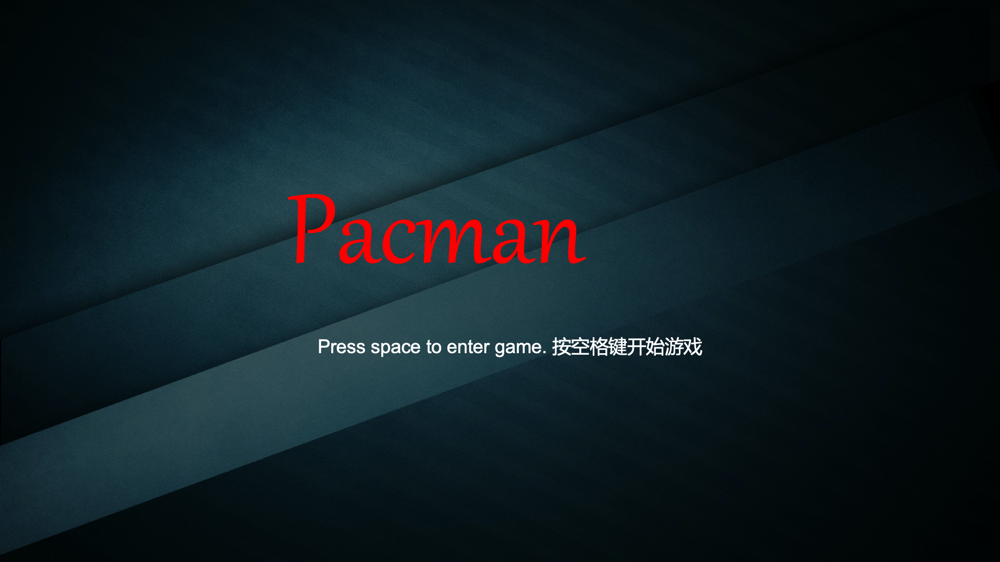

# PacmanCG

A 2D Pacman game as my final CG project using modern OpenGL.

The code is based on the turtorial from [LearnOpenGL](http://learnopengl.com/).

### Requirements

* OpenGL > 3.3
* GLFW
* GLEW
* GLM

To compile the project, you need to specify those directories in `CMakeLists.txt`.

All .png resources are from the Internet.

### About directories

* ./CMakeLists.txt：CMake Configurations

* ./main.cpp：main function

* ./src：implemetation of class files (.cpp)

* ./include/：class header files (.h)

* ./include/shader：shader files(.vs/.fs)

* ./resources/：all resources files

* ./resources/textures：Texture resourese (.png files)

* ./resources/textures：Level information (2D matrix in .lvl files)

### Run demo

